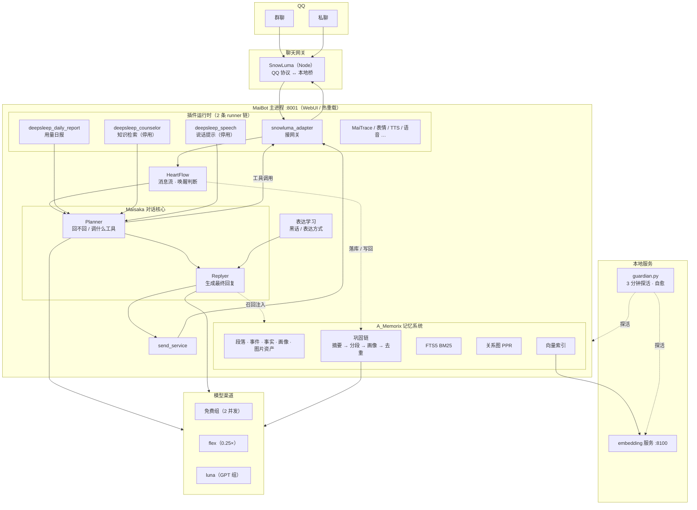
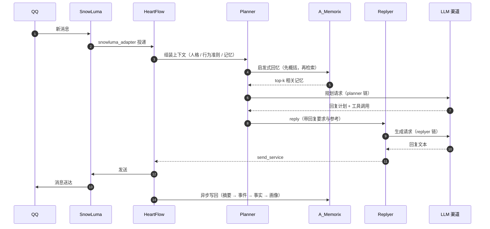
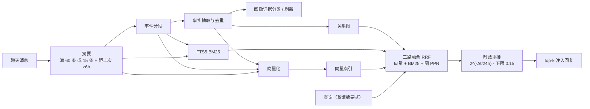
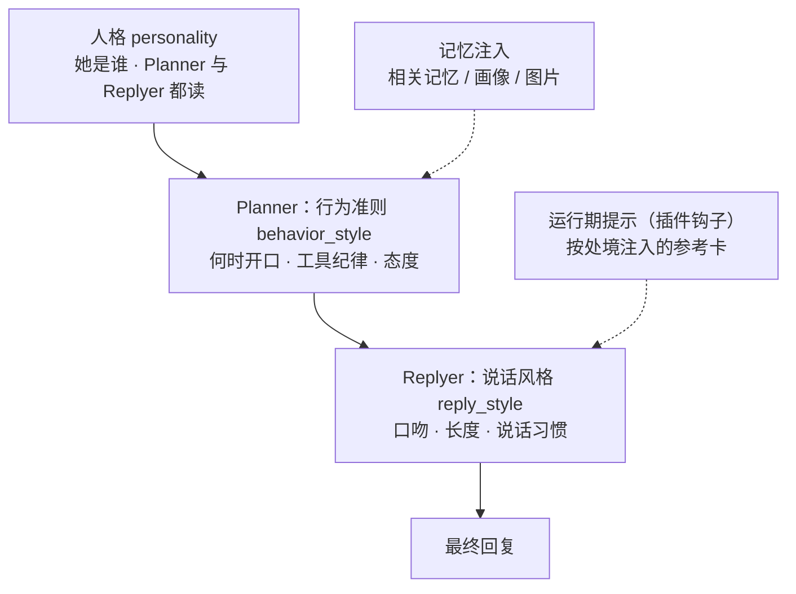

# 架构

四张图：总体组件、一条消息的旅程、记忆系统读写链、说话的分层。

## 1. 总体组件

```mermaid
flowchart TB
    subgraph QQ["QQ"]
        U1["群聊"]
        U2["私聊"]
    end

    subgraph EDGE["聊天网关"]
        SL["SnowLuma（Node）<br/>QQ 协议 ↔ 本地桥"]
    end

    subgraph CORE["MaiBot 主进程 :8001（WebUI / 热重载）"]
        HF["HeartFlow<br/>消息流 · 唤醒判断"]
        subgraph MAISAKA["Maisaka 对话核心"]
            PL["Planner<br/>回不回 / 调什么工具"]
            RP["Replyer<br/>生成最终回复"]
        end
        subgraph PLUGINS["插件运行时（2 条 runner 链）"]
            P1["snowluma_adapter<br/>接网关"]
            P2["deepsleep_daily_report<br/>用量日报"]
            P3["deepsleep_counselor<br/>知识检索（停用）"]
            P4["deepsleep_speech<br/>说话提示（停用）"]
            P5["MaiTrace / 表情 / TTS / 语音 …"]
        end
        subgraph MEM["A_Memorix 记忆系统"]
            M1["段落 · 事件 · 事实 · 画像 · 图片资产"]
            M2["向量索引"]
            M3["FTS5 BM25"]
            M4["关系图 PPR"]
            M5["巩固链<br/>摘要 → 分段 → 画像 → 去重"]
        end
        EL["表达学习<br/>黑话 / 表达方式"]
        SS["send_service"]
    end

    subgraph SERVICES["本地服务"]
        EMB["embedding 服务 :8100"]
        GD["guardian.py<br/>3 分钟探活 · 自愈"]
    end

    subgraph LLM["模型渠道"]
        L1["免费组（2 并发）"]
        L2["flex（0.25×）"]
        L3["luna（GPT 组）"]
    end

    U1 --> SL
    U2 --> SL
    SL --> P1 --> HF --> PL
    PL -->|工具调用| P1
    PL --> RP
    RP --> SS --> P1 --> SL
    RP -.->|召回注入| MEM
    M2 --> EMB
    HF -.->|落库 / 写回| M5
    PL --> LLM
    RP --> LLM
    M5 --> LLM
    P2 --> PL
    P3 --> PL
    P4 --> PL
    EL --> RP
    GD -.->|探活| CORE
    GD -.->|探活| EMB
```

## 2. 一条消息的旅程

```mermaid
sequenceDiagram
    autonumber
    participant Q as QQ
    participant S as SnowLuma
    participant H as HeartFlow
    participant P as Planner
    participant M as A_Memorix
    participant R as Replyer
    participant L as LLM 渠道

    Q->>S: 新消息
    S->>H: snowluma_adapter 投递
    H->>P: 组装上下文（人格 / 行为准则 / 记忆）
    P->>M: 启发式回忆（先概括，再检索）
    M-->>P: top-k 相关记忆
    P->>L: 规划请求（planner 链）
    L-->>P: 回复计划 + 工具调用
    P->>R: reply（带回复要求与参考）
    R->>L: 生成请求（replyer 链）
    L-->>R: 回复文本
    R-->>H: send_service
    H->>S: 发送
    S->>Q: 消息送达
    H->>M: 异步写回（摘要 → 事件 → 事实 → 画像）
```

## 3. 记忆系统读写链

```mermaid
flowchart LR
    MSG["聊天消息"] --> SUM["摘要<br/>满 60 条 或 15 条 + 距上次 ≥6h"]
    SUM --> EP["事件分段"]
    EP --> FACT["事实抽取与去重"]
    FACT --> PROF["画像证据分类 / 刷新"]
    SUM --> VEC["向量化"]
    EP --> VEC
    FACT --> VEC
    VEC --> IDX["向量索引"]
    SUM --> FTS["FTS5 BM25"]
    EP --> FTS
    FACT --> GRAPH["关系图"]

    QRY["查询（蒸馏摘要式）"] --> RRF["三路融合 RRF<br/>向量 + BM25 + 图 PPR"]
    IDX --> RRF
    FTS --> RRF
    GRAPH --> RRF
    RRF --> DECAY["时效重排<br/>2^(-Δt/24h) · 下限 0.15"]
    DECAY --> TOPK["top-k 注入回复"]
```

## 4. 说话的分层

```mermaid
flowchart TD
    A["人格 personality<br/>她是谁 · Planner 与 Replyer 都读"] --> C["Planner：行为准则 behavior_style<br/>何时开口 · 工具纪律 · 态度"]
    C --> D["Replyer：说话风格 reply_style<br/>口吻 · 长度 · 说话习惯"]
    D --> E["最终回复"]
    B["运行期提示（插件钩子）<br/>按处境注入的参考卡"] -.-> D
    F["记忆注入<br/>相关记忆 / 画像 / 图片"] -.-> C
```

> 经验：**态度类改动必须同时落在人格与 `behavior_style`**——只改 `reply_style` 只影响"嘴"，Planner 仍会按旧态度规划内容。
